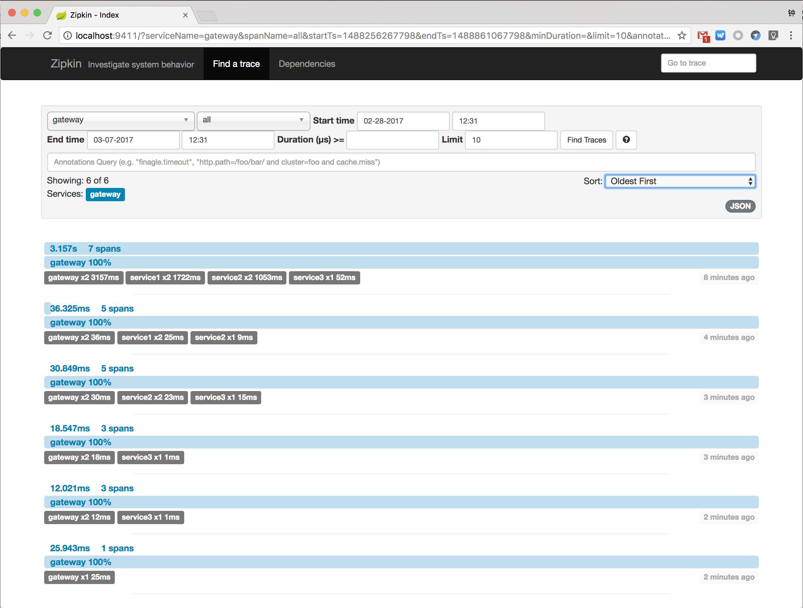

# Build docker images


```bash
mvn clean install -PbuildDocker
```

# Start up demo cluster

```bash
docker-compose up
```

#  Demo

Open your browser with <http://localhost:8080/1,2,3> , then jump to <http://localhost:9411> , you will find a trace like:




